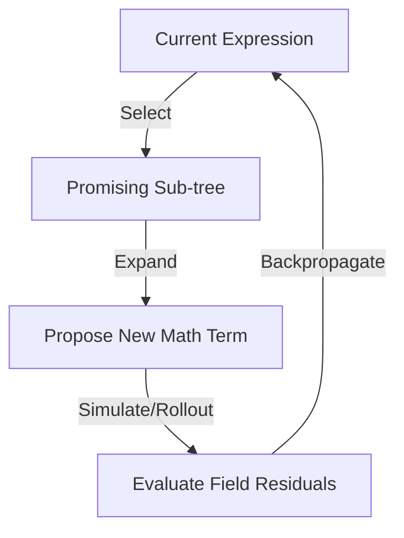

# Advanced Search Strategies for Massive Symbolic Spaces

Discovering exact or highly accurate closed-form solutions in general relativity and modified gravity involves searching an **infinite, discrete, non-linear mathematical space**. 

As we move from static spacetimes to rotating spacetimes and modified gravity (EdGB), the search space expands exponentially. This document details the bottlenecks of our current approach and proposes advanced search techniques to navigate this territory.

---

## 1. The Bottleneck of our Current Approach (Genetic Programming)

Our current engine uses **Genetic Programming (GP)** to evolve expression trees (nodes like `+`, `-`, `*`, `/`, `1/r`, constants), combined with a **Gauss-Newton local optimizer** to fit parameters.

### Strengths
- **Low Overhead**: Extremely fast to evaluate small trees; no training data or neural networks required.
- **Parsimony Pressure**: Naturally favors simple equations when combined with complexity penalties.

### Bottlenecks
1. **Blind Exploration**: Crossover and mutation operators are random. GP has no "foresight" or understanding of mathematical structure (e.g., it doesn't know that adding a certain term might help cancel a specific curvature singularity).
2. **Gauge/Coordinate Costumes**: A single physical metric can be written in infinite coordinate forms. GP gets trapped searching through redundant coordinate variations (e.g., trig coordinates vs. rational coordinates), wasting compute.
3. **Stagnation**: GP easily gets stuck in local minima, plateauing on complex spacetimes.

---

## 2. Option A: Monte Carlo Tree Search (MCTS)

Instead of random mutations, we can frame mathematical formula generation as a **turn-based game** (like Chess or Go). 
- **Board State**: The current mathematical expression tree.
- **Legal Moves**: Adding a node (e.g., `+ 1/r`, `* cos(theta)`), replacing a leaf, or modifying a constant.
- **Game Goal**: Achieve exact cancellation of the field equations (or minimize numerical fitting residuals).



### How MCTS Works Here
1. **Selection**: Traverse the tree of expression modifications using a selection formula (like UCB1) that balances **exploration** (trying untested math structures) and **exploitation** (refining near-misses).
2. **Expansion**: Propose new mathematical operations to attach to the tree.
3. **Rollout (Simulation)**: Complete the expression using a fast heuristic (or random completions) and evaluate how close it gets to solving the field equations.
4. **Backpropagation**: Update the score of all parent nodes based on how successful the rollout was.

### AlphaZero/AlphaTensor Flavor (Neural-MCTS)
We can train a small, local policy network to guide the MCTS:
- **Policy Network**: Inputs the current expression state and outputs a probability distribution over the most likely "fruitful" mathematical moves (e.g., "add a $1/r^2$ term because we have a mass parameter").
- **Value Network**: Predicts whether the current expression can be simplified into a solution.

> [!TIP]
> **When to use MCTS**: Best when we have a well-defined set of building blocks and want a directed, tree-based search that doesn't suffer from genetic stagnation.

---

## 3. Option B: E-graphs & Equality Saturation

One of the biggest issues in symbolic search is **equivalence**. The expressions $r(1 - 2M/r)$ and $r - 2M$ are mathematically identical, but GP treats them as different trees and evaluates them separately. This is even worse for trigonometric or gauge identities.

An **E-graph (Equality Graph)** is a data structure that compactly stores equivalence classes of expressions.

```
       E-Class 1 (Numerator)       E-Class 2 (Denominator)
       ┌─────────────────────┐     ┌─────────────────────┐
       │   r * (1 - 2M/r)    │     │       r - 2M        │
       │      r - 2M         │     │  r * (1 - 2M/r)     │
       └──────────┬──────────┘     └──────────┬──────────┘
                  │                           │
                  └─────────────►/◄───────────┘
```

### How E-graphs Help
- **Equality Saturation**: We input a set of mathematical rewrite rules (e.g., $x/x \to 1$, $\sin^2\theta + \cos^2\theta \to 1$, gauge transformations). The E-graph expands to represent all equivalent ways to write our equations *without duplicating data*.
- **Cost Minimization**: We can query the E-graph for the "cheapest" (shortest, most rational) version of any candidate expression.
- **Evasion of Costumes**: It prevents the search engine from wasting time evaluating different "costumes" of the same metric.

> [!IMPORTANT]
> **E-graphs do not generate new solutions**; they find optimal representations of existing expressions. They are best used as an automatic simplifier and canonicalizer integrated into the search loop.

---

## 4. Option C: LLM-Guided Proposer (Hybrid Loop)

Instead of using purely discrete search algorithms, we leverage a Large Language Model (running locally or via API) as a high-level "physicist."

```
┌────────────────────────────────────────────────────────┐
│                      Local LLM                         │
│   - Reads literature and suggests ansatz templates      │
│   - Recommends coordinate transformations              │
└──────────────────────────┬─────────────────────────────┘
                           │ Suggests Ansatz
                           ▼
┌────────────────────────────────────────────────────────┐
│                   Symbolic Engine                      │
│   - Performs exact substitutions (SymPy)               │
│   - Solves for algebraic coefficients                  │
└──────────────────────────┬─────────────────────────────┘
                           │ Calculates Residuals
                           ▼
┌────────────────────────────────────────────────────────┐
│                   Gauss-Newton Fitter                  │
│   - Numerically fits free constants                    │
└────────────────────────────────────────────────────────┘
```

### Why this is powerful
- **Physical Intuition**: LLMs "know" about asymptotic flatness, horizon conditions, and standard metric forms (Kerr, Schwarzschild, BTZ) from their training data.
- **Adaptive Proposer**: If the engine reports "singularity at $r=2M$", the LLM can recommend "try a coordinate transformation to tortoise coordinates or Eddington-Finkelstein coordinates."
- **Focus**: The LLM handles the high-level structural design of the ansatz, while SymPy and the numeric fitter handle the exact calculations.

---

## 5. Comparison of Search Strategies

| Strategy | Exploration Efficiency | Implementation Complexity | Computational Cost | Best Suited For |
| :--- | :--- | :--- | :--- | :--- |
| **Genetic Programming (GP)** (Current) | Moderate | Low | Low | Finding simple, 1D metric components with few terms. |
| **MCTS (Monte Carlo Tree Search)** | High | High | Moderate | Searching deep, complex formula trees where order of terms matters. |
| **E-graphs** | N/A (Rewrite only) | Moderate | Low | Pre-processing, canonicalizing, and simplifying expressions to remove gauge redundancy. |
| **LLM-Guided Loop** | Very High | Low-Moderate | Low-Moderate | Highly complex, multi-dimensional spacetimes (like 3+1 rotating Kerr/EdGB) requiring coordinate insight. |

---

## 6. Recommended Next Steps

1. **Complete the Rotating EdGB R1 Track**: Complete and pass the corrected `20_rot_shoot.py` script to establish our numerical rotating black hole baseline.
2. **Integrate E-graphs for Simplification**: Use a Python-based E-graph library (or a robust set of SymPy canonicalization rules) to automatically simplify candidate metric forms before checking their fingerprints.
3. **Build a Simple LLM Proposer**: Set up a lightweight wrapper that feeds near-misses and error summaries to an LLM, asking it to propose the next symbolic structure, bypassing GP's random mutations for complex spaces.
